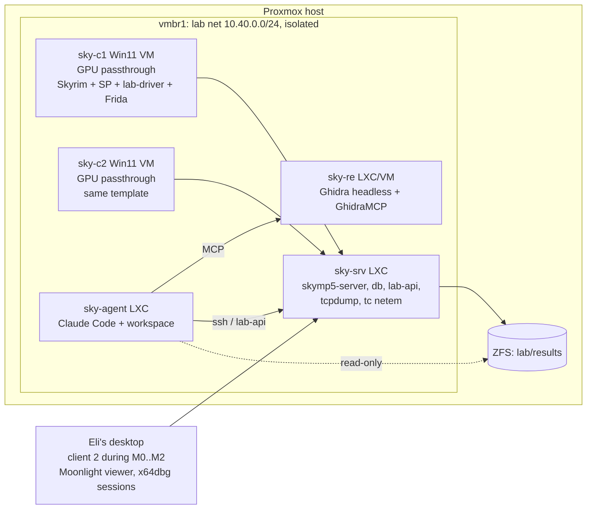

# LAB: testing infrastructure on Proxmox

The lab exists because T3 is the only tier that proves a verb, and a human
watching two Skyrim windows does not scale. Everything here is in service of
one loop: agent writes a verb, a scenario runs unattended, artifacts land in
lab/results/<run>/, the agent reads them, and a human is pulled in only for
the dynamic plan.

## Topology



Roles:

- sky-srv: Debian LXC. Runs the server, the database, and lab-api (the
  scenario runner). Owns packet capture and fault injection because it sits
  on every flow. Snapshot before each run, rollback after.
- sky-c1, sky-c2: Windows 11 VMs from one template. Each has its own GPU.
  During M0 to M2 only sky-c1 exists and Eli's desktop is client two; sky-c2
  arrives when scenarios need a third observer or full unattended runs.
- sky-re: Ghidra headless with GhidraMCP exposed on the lab net only. One
  project: SkyrimSE.exe 1.6.1170, analyzed once, CommonLib types imported.
- sky-agent: the Claude Code container. Holds the workspace checkout,
  .mcp.json pointing at sky-re, ssh to sky-srv, read-only mount of results.
  No route to the client VMs except through lab-api.

## Host requirements

- IOMMU enabled (intel_iommu=on or amd_iommu=on), VFIO bound to the client
  GPUs, q35 machine type, OVMF. Proxmox's PCI(e) passthrough wiki is the
  reference; do not improvise the vfio configuration.
- One GPU per concurrent Windows client. Options, cheapest first:
  1. Eli's desktop as client two, one used dGPU (GTX 1060 / RX 580 class is
     plenty at 1080p low) passed to sky-c1.
  2. Intel iGPU SR-IOV virtual functions (12th to 14th gen with the
     i915-sriov-dkms driver): several VFs from one iGPU, each with a Windows
     driver. Skyrim at 720p low is playable enough for sync tests, not for
     performance work. Treat as an experiment, not a plan.
  3. A second dGPU for sky-c2 when unattended three-party scenarios start.
- RAM: 16 GB per Windows client, 4 GB sky-srv, 8 GB sky-re, 4 GB sky-agent.
- Storage: ZFS. Templates plus linked clones for the client VMs; a separate
  dataset for lab/results with a retention policy.
- Display: each client GPU needs a display target for D3D11 when nobody is
  looking. A dummy HDMI plug or a virtual display driver; Sunshine for remote
  viewing, Moonlight on Eli's desktop.
- Licensing: one licensed copy of Skyrim SE per concurrent client, so two
  Steam accounts (Steam blocks the same game running twice on one account).
  Steam in offline mode inside the VMs. Skyrim's update setting to "only
  update when I launch it", SkyrimSE.exe 1.6.1170 backed up outside the
  Steam folder. Windows Update paused. Version drift is the number one way
  this lab dies.
- Network: vmbr1 has no upstream route after provisioning. Steam offline
  mode makes that fine.

## Client VM template (tpl-sky-client)

Build once, snapshot, clone per run. Snapshot chain:

1. `clean-desktop`: Windows 11, VirtIO disk and NIC, QEMU guest agent,
   autologon, GPU driver, Sunshine, virtual display, Windows Update paused,
   Steam in offline mode, Skyrim SE 1.6.1170 verified, SKSE 2.2.6 installed.
2. `clean-sp`: Skyrim Platform, skymp5-client configured for sky-srv, the
   lab-driver SP plugin, Frida server registered as a scheduled task,
   PowerShell helper for screenshots.
3. `connected`: game running via the SKSE loader, connected to a clean
   server, standing at the lab spawn. This is where most scenarios start;
   rollback to it costs seconds instead of a full launch.

lab-driver is a small SP plugin: on the `update` tick it polls
`http://sky-srv/lab/step?client=<id>` (SP ships an HTTP client), executes the
step it gets back (teleport via server command, equip, cast, activate, hit,
wait, request-screenshot, dump-state), and posts the result with the
client's view of the relevant refs. It is the only automation surface
inside the game; keep its verbs boring.

Screenshots and Frida invocations go through `qm guest exec` from lab-api
rather than through the game, so a crashed client can still be observed.

## Scenario runner (lab-api on sky-srv)

Input is a YAML scenario (see lab/scenarios/). The runner:

1. Rolls the server back to the scenario's snapshot; applies netem if asked.
2. Rolls each named client back to its snapshot and starts it; waits for the
   lab-driver heartbeat.
3. Feeds steps in order; each step names a client or the server; waits for
   the ack or the timeout.
4. Runs assertions: server-side by querying the DB and the server's state
   endpoint; client-side against what lab-driver reported; wire-side against
   the pcap when a step asks for it.
5. Collects artifacts and writes result.json. Exit code is the verdict.

Artifacts per run, under lab/results/<timestamp>-<scenario>/:
server.log, c1.log, c2.log, screenshots/, db-before.sqlite, db-after.sqlite,
lab.pcap, frida/*.jsonl, result.json. During M0 and M1 the pcap is also the
source for difftest sessions: `pcap2session` runs on it and the resulting
YAML lands in skymp-wire/difftest/sessions/ (docs/WIRE.md).

Assertions live in the YAML, and the runner is the only thing that can mark
a scenario green. An agent that wants a scenario to pass edits the code, not
the YAML; YAML changes are reviewed like validator changes.

## Network faults

Inside sky-srv, per scenario:

```
tc qdisc add dev eth0 root netem delay 60ms 15ms loss 0.5%
```

Cleared on teardown. Every M2+ scenario runs at least once with faults on,
because lag compensation and host handoff are the things that only break
under them. tcpdump on vmbr1 gives the pcap; T2 fake clients use the same
capture path so wire assertions are shared between tiers.

## Dynamic RE lane

Two speeds:

- Agent-drivable: Frida. Scripts hook functions by Address Library ID
  (resolved to an address at attach time from the loaded module base), log
  arguments and return values as jsonl, and are started and stopped by
  scenario steps through `qm guest exec`. The agent writes the script from
  the verb doc's Dynamic section, runs the scenario, and reads the trace.
  This is what turns "learn its side effects" into something that can happen
  overnight. Skyrim has no anti-cheat; SKSE and Frida coexist.
- Human: an x64dbg session on a `sky-dbg` snapshot of sky-c1 (x64dbg
  installed, addresses pre-resolved from addrlib into a labels file). The verb
  doc's breakpoint plan is the script for the session; Moonlight to watch;
  findings go back into the verb doc as CONFIRMED with the run id.

## CI

- T0 and T1 on every push, in sky-agent or a runner container.
- T2 nightly and on every PR that touches the wire contract.
- T3 nightly for the current milestone's scenario set; on demand with a
  `lab` label. A scenario that fails twice reopens its verb.
- The runner reaches Proxmox through an API token (`qm` over ssh is fine to
  start; the bpg/proxmox Terraform provider when the VM count stops changing).

## Bill of constraints

- GPUs equal concurrent VM clients.
- Licenses equal concurrent clients.
- Windows activation per VM.
- A T3 run is minutes; a human dynamic session is an hour. Size verbs so
  one run answers one question.
- Client VMs are never reachable from sky-agent directly; lab-api is the
  boundary, and results are read-only to the agent.

## Build order

1. sky-srv plus T2 fake clients. No GPU, no Windows; unblocks M1 entirely.
   sky-srv runs both the legacy C++ server and the bridged server on
   different ports until the bridge PR lands, so difftest can drive both.
2. sky-re with GhidraMCP; sky-agent with the workspace and .mcp.json.
3. sky-c1 with one passed-through GPU; Eli's desktop as client two;
   `smoke-two-players` green.
4. sky-c2 when M2 observer scenarios need it.

## References

- Proxmox PCI(e) passthrough: https://pve.proxmox.com/wiki/PCI(e)_Passthrough
- i915 SR-IOV DKMS: https://github.com/strongtz/i915-sriov-dkms
- GhidraMCP: https://github.com/LaurieWired/GhidraMCP
- ReVa (Ghidra MCP with xref context): https://github.com/cyberkaida/reverse-engineering-assistant
- Frida: https://frida.re
- Sunshine: https://github.com/LizardByte/Sunshine
- Moonlight: https://moonlight-stream.org
- x64dbg: https://x64dbg.com
- CommonLibSSE-NG host-less testing note: https://github.com/CharmedBaryon/CommonLibSSE-NG
- Skyrim Platform HTTP and events: https://github.com/skyrim-multiplayer/skymp/blob/main/docs/docs_skyrim_platform.md
