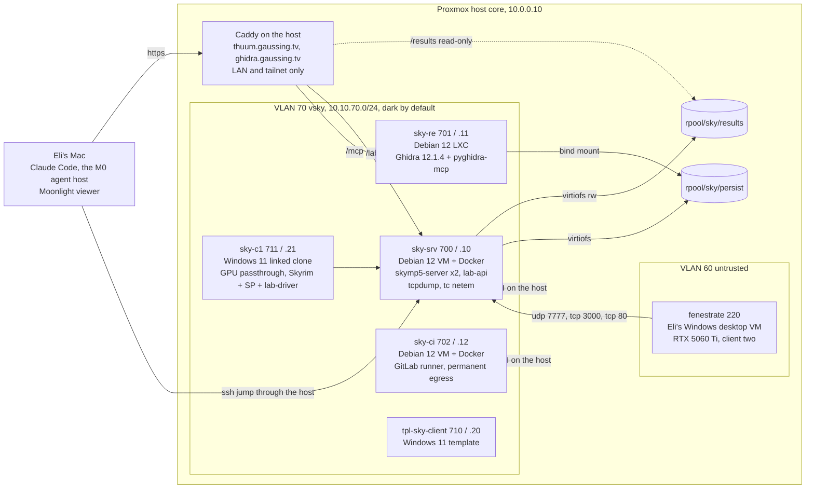

# LAB: testing infrastructure on Proxmox

The lab exists because T3 is the only tier that proves a verb, and a human
watching two Skyrim windows does not scale. Everything here is in service of
one loop: agent writes a verb, a scenario runs unattended, artifacts land in
the results dataset, the agent reads them, and a human is pulled in only for
the dynamic plan.

Two halves. The substrate (VLAN, guests, storage, DNS, access, runner) is
IaC in the estate repo, mojibake/core (Terraform bpg/proxmox plus Ansible),
driven by its operator command `sky-lab up|verify|down|reset|status` with
`snapshot` and `rollback` helpers. The lab software (lab-api, lab-driver,
scenarios, Frida scripts) lives in this repo under lab/. This document is the
contract between them, agreed on 2026-09-24 (ADR-016); a change on either
side updates this file in the same change.

## Topology



## Guests

| name | VMID | IP | kind | power |
| --- | --- | --- | --- | --- |
| sky-srv | 700 | 10.10.70.10 | Debian 12 VM + Docker | on demand (`sky-lab up`) |
| sky-re | 701 | 10.10.70.11 | Debian 12 LXC, Ghidra 12.1.4 + JDK 21 + pyghidra-mcp | on demand |
| sky-ci | 702 | 10.10.70.12 | Debian 12 VM + Docker, dedicated GitLab runner | always on |
| sky-agent | 703 | 10.10.70.13 | reserved, not built | (M1) |
| tpl-sky-client | 710 | 10.10.70.20 | Windows 11 template | template |
| sky-c1 | 711 | 10.10.70.21 | linked clone + GPU | on demand |
| sky-c2 | 712 | 10.10.70.22 | reserved | (M2) |
| sky-build | 720 | 10.10.70.30 | reserved Windows build box | (fallback) |

VLAN 70, SDN zone `sky`, bridge `vsky`, subnet 10.10.70.0/24, gateway
10.10.70.1 (the host itself). Guest VMIDs 700 to 739 form the Proxmox
resource pool `sky`; nothing outside that range is ever in the pool.

Roles:

- sky-srv: runs the server from upstream's Docker runtime image as two compose
  services, the legacy C++ build now and the Rust-bridged build from M1, on
  different ports so difftest can drive both. Also lab-api (the scenario
  runner), the database, packet capture, and fault injection, because it sits
  on every game flow. Snapshotted before each run and rolled back after.
- sky-re: Ghidra headless with pyghidra-mcp serving the project over
  streamable HTTP. One project: SkyrimSE.exe 1.6.1170, analyzed once,
  CommonLibSSE-NG types imported, stored on rpool/sky/persist.
- sky-ci: the only runner that executes this project's jobs. The estate's own
  runner holds root on the host and never runs a fork job.
- sky-c1: Windows 11 linked clone of tpl-sky-client with a passed-through GPU,
  Skyrim SE plus Skyrim Platform plus lab-driver plus Frida.
- fenestrate (VM 220, VLAN 60): Eli's Windows desktop VM, which holds the
  host's only discrete GPU (RTX 5060 Ti). It is client two during M0 to M2,
  allow-listed to sky-srv on udp/7777, tcp/3000, and tcp/80. It is never in
  pool `sky`, never snapshotted, rolled back, or guest-exec'd by lab-api;
  its only lab role is lab-driver polling lab-api from inside the game. M0 T3
  runs are therefore attended: Eli launches the game on fenestrate.
- Agent: Claude Code on Eli's Mac in M0 (ADR-016). It reaches the lab only
  through the Caddy names and the SSH jump; it has no route into VLAN 70.
  sky-agent stays reserved until unattended overnight loops need it.

## Names and access

Names used from the Mac are Caddy vhosts on the host, LAN and tailnet only,
403 to everything else:

- `LAB_API=https://thuum.gaussing.tv/lab` proxies to sky-srv:80 (lab-api).
- `https://thuum.gaussing.tv/results/<run>/` serves rpool/sky/results
  read-only, straight off the dataset.
- `GHIDRA_MCP_URL=https://ghidra.gaussing.tv/mcp` proxies to sky-re:8080
  (pyghidra-mcp, streamable HTTP). `.mcp.json` names it as a URL-type server.

Pi-hole holds `sky-srv.gaussing.tv` style A records for every guest, but
those addresses are only routable from the host, from the tailnet with
routes, or through the jump: `ssh -J root@10.0.0.10 eli@10.10.70.10`, with
`~/.ssh/config` aliases `sky-srv`, `sky-re`, `sky-ci`.

The Proxmox API is called at `https://10.0.0.10:8006` directly (Caddy 403s
guest VLANs) with an API token scoped to pool `sky` and a custom role holding
exactly VM.Audit, VM.PowerMgmt, VM.Snapshot, VM.Snapshot.Rollback,
VM.GuestAgent.Unrestricted, and VM.GuestAgent.FileRead. lab-api on sky-srv
and the jobs on sky-ci use that same token and path; `sky-lab` is the
operator's IaC command and is not called from CI.

## Egress

- Policy table 105, dark by default: blackhole default route, blackhole every
  other VLAN and the LAN, /32 allows for Pi-hole and fenestrate, a LAN return
  route only for DNAT'd Sunshine replies. Every lab guest sits here.
- Setup lease for template builds and one-time installs (Windows, Steam's
  download of Skyrim SE, SKSE, drivers, Ghidra, the JDK): `sky-lab egress
  open --minutes N`, renewable while a build runs, auto-relocks when it
  expires. Direct home IP, no VPN: nothing here needs to hide and Steam is
  happier off one.
- Policy table 106, permanent direct egress bound per host: sky-ci now
  (GitHub, crates.io, vcpkg sources), sky-agent later.
- Pi-hole additionally blocks Steam and Windows Update domains for the
  10.10.70.0/24 client group. Steam offline mode plus no route is the actual
  requirement; the DNS block is belt and braces. Version drift (Steam or
  Windows Update replacing the pinned exe) is the number one way this lab
  dies.
- Intra-VLAN traffic never touches the host, so server-to-client separation
  is not enforced by routing. Agent isolation is: the Mac has no route into
  VLAN 70 beyond the named vhosts and the jump. No second vnet.

## Host requirements

- IOMMU on, VFIO bound to the client GPU, q35, OVMF, vTPM (Windows 11 wants
  TPM 2.0), VirtIO disk and NIC, QEMU guest agent, host CPU type. Proxmox's
  PCI(e) passthrough wiki is the reference; do not improvise the vfio
  configuration.
- GPU: one per concurrent lab-owned Windows client. The host's only discrete
  GPU belongs to fenestrate. Decided 2026-09-24: sky-c1 gets a used
  low-profile NVIDIA card (GTX 1650 class, no auxiliary power) in one of the
  board's PCIe 4.0 x1-wired slots, which is enough for Skyrim at 1080p low
  once assets are resident; NVIDIA resets reliably under vfio on this host.
  The 9950X3D iGPU (RDNA2, two CUs) stays an inert, variable-guarded
  experiment in the IaC: reports of passing through once per host boot make
  it unfit for a rollback-heavy lab, and it is the host console. sky-c2 needs
  a third GPU (M2).
- RAM: the host has 96 GB and is tight. Phase 1 fits. Phase 3 with fenestrate
  as client two does not fit at full size: on a T3 night sky-re is powered
  off, sky-srv and sky-ci sit at their balloon floors, sky-c1 runs at 12 GB
  (Skyrim SE's published minimum is 8 GB), the IDS keeps running, and
  fenestrate is never resized. `sky-lab up` refuses to start T3 when free
  memory is short. A RAM upgrade is Eli's call.
- Storage: ZFS. `rpool/sky/results` (quota 500 GB, no snapshots, 30-day age
  pruning on the host) is shared into sky-srv over virtiofs at
  /srv/lab/results read-write, so a rollback of sky-srv can never delete the
  run that just finished. `rpool/sky/persist` (200 GB, snapshotted daily,
  kept) is bind-mounted into sky-re for the Ghidra project and shared into
  sky-srv for the five master .esm files, the pinned exe backup, and addrlib.
  The Windows template disk is 120 GB on the guest pool, exempt from the
  estate's hourly snapshot policy. Licensed files never leave rpool/sky.
- Display: the client GPU needs a display target for D3D11 when nobody is
  looking, a dummy HDMI plug or a virtual display driver; Sunshine for remote
  viewing, Moonlight on fenestrate or the Mac.
- Licensing: one licensed copy of Skyrim SE per concurrent client, so two
  Steam accounts (Steam blocks the same game running twice on one account),
  and a Windows activation per VM. Steam in offline mode inside the VMs,
  Skyrim's update setting on "only update when I launch it", SkyrimSE.exe
  1.6.1170 backed up on rpool/sky/persist, Windows Update paused.
- Skyrim is single-thread bound: host CPU type and no oversubscription on the
  Windows VMs during runs, or scenario timings lie.

## Client VM template (tpl-sky-client)

Build once behind a setup lease, snapshot, clone per run. Snapshots are
disk-only: QEMU refuses snapshots with RAM for any VM with a vfio device, so
there is no "connected" snapshot to roll back to. Snapshot chain:

1. `clean-desktop`: Windows 11, VirtIO disk and NIC, QEMU guest agent,
   autologon, GPU driver, Sunshine, virtual display, Windows Update paused,
   Steam in offline mode, Skyrim SE 1.6.1170 verified, SKSE 2.2.6 installed.
2. `clean-sp`: Skyrim Platform, skymp5-client configured for sky-srv, the
   lab-driver SP plugin, Frida server registered as a scheduled task, a
   PowerShell helper for screenshots, and a scheduled task at logon that
   launches the game through the SKSE loader.

"Connected" is not a snapshot; it is where a clone arrives by itself: stop,
rollback to `clean-sp`, cold boot, autologon, the scheduled task launches
SKSE and lab-driver, lab-driver heartbeats to lab-api. Budget 90 to 120 s per
client rollback; scenario timeouts are sized for it.

lab-driver is a small SP plugin: on the `update` tick it polls
`GET /lab/step?client=<id>` (SP ships an HTTP client), executes the step it
gets back (teleport via server command, equip, cast, activate, hit, wait,
request-screenshot, dump-state), and posts the result to
`POST /lab/step/<id>/result` with the client's view of the relevant refs. It
is the only automation surface inside the game; keep its verbs boring. On
sky-c1 it reaches lab-api at http://10.10.70.10/lab inside the VLAN; on
fenestrate through the tcp/80 allow.

Screenshots and Frida invocations go through a guest exec from lab-api,
not through the game, so a crashed client can still be observed. Scripts
reach the client by the client pulling them from lab-api over http inside
that guest exec; artifacts come back through the Proxmox guest-agent file
API, which caps each file at 16 MiB, so Frida traces are rotated into files
under that size. The token has no FileWrite privilege.

## Scenario runner (lab-api on sky-srv)

Python, listening on sky-srv:80 under the root path /lab (a setting), behind
Caddy at https://thuum.gaussing.tv/lab. It honors X-Forwarded-For for logs
and has no auth of its own; the vhost is LAN and tailnet only. Endpoints,
pinned:

| method and path | purpose |
| --- | --- |
| POST /lab/up | bring the lab up: sky-srv snapshot check, clients cloned or rolled back, heartbeats waited on |
| POST /lab/down | roll back clients and server, clear netem |
| GET /lab/status | guest power, heartbeats, netem state, free memory |
| POST /lab/run | multipart scenario YAML in; returns a run id immediately |
| GET /lab/run/<id> | progress, then result.json when the run is done |
| GET /lab/step?client=<id> | lab-driver's poll for the next step |
| POST /lab/step/<id>/result | lab-driver's report for a step |
| POST /lab/frida | client and script in; starts a trace through a guest exec |
| GET /lab/state/<query> | proxy to the lab gamemode's state endpoint on the server |

Results are browsed at https://thuum.gaussing.tv/results/<run>/.

Input is a YAML scenario (see lab/scenarios/). The runner:

1. Rolls the server back to the scenario's snapshot: stop, rollback to the
   named disk snapshot, start, `docker compose up`, wait for udp/7777.
   Budget 20 to 40 s. sky-srv carries virtio-fs shares, which are
   incompatible with RAM snapshots, so this rollback is disk-only like the
   clients'. No guest anywhere in the lab depends on a RAM snapshot; sky-re
   is rolled back the same way with `pct`.
2. Applies netem if asked.
3. Rolls each named lab-owned client back and starts it; waits for the
   lab-driver heartbeat. fenestrate is never rolled back; the runner only
   waits for its heartbeat.
4. Feeds steps in order; each step names a client or the server; waits for
   the ack or the timeout.
5. Runs assertions: server-side through the lab gamemode's state endpoint
   and the database directory; client-side against what lab-driver reported;
   wire-side against the pcap when a step asks for it.
6. Collects artifacts and writes result.json. Exit code is the verdict.

Artifacts per run, under /srv/lab/results/<timestamp>-<scenario>/:
server.log, c1.log, c2.log, screenshots/, world-before/ and world-after/
(copies of the server's `world/` directory, the `file` database driver;
there is no sqlite), world-diff, lab.pcap, frida/*.jsonl, result.json.
During M0 and M1 the pcap is also the source for difftest sessions:
`pcap2session` runs on it and the resulting YAML lands in
skymp/skymp-wire/difftest/sessions/ (docs/WIRE.md).

Server settings in the lab: `offlineMode` true (any profile id may connect),
`databaseDriver` `file`, port 7777 (udp) with the embedded UI on 3000 (https,
non-configurable, main port + 1 when the main port moves), the master-list
announce to skymp.io disabled, the five master .esm files from
rpool/sky/persist in the data directory, plus the lab gamemode script.

Assertions live in the YAML, and the runner is the only thing that can mark
a scenario green (ADR-009). Scenario YAML is review-gated (ADR-016): a
change travels in its own commit, Eli approves it, and CI refuses a commit
that mixes scenario YAML with other files.

## Network faults

Inside sky-srv, per scenario:

```
tc qdisc add dev eth0 root netem delay 60ms 15ms loss 0.5%
```

Cleared on teardown. Every M2+ scenario runs at least once with faults on,
because lag compensation and host handoff are the things that only break
under them. tcpdump on sky-srv's own interface gives the pcap; it sees only
sky-srv's flows, which is all the game traffic, and T2 fake clients use the
same capture path so wire assertions are shared between tiers.

## Dynamic RE lane

Two speeds:

- Agent-drivable: Frida. Scripts hook functions by Address Library ID
  (resolved to an address at attach time from the loaded module base), log
  arguments and return values as jsonl, and are started and stopped by
  scenario steps through a guest exec. The agent writes the script from the
  verb doc's Dynamic section, runs the scenario, and reads the trace from
  the results dataset. This is what turns "learn its side effects" into
  something that can happen overnight. Skyrim has no anti-cheat; SKSE and
  Frida coexist.
- Human: an x64dbg session on a `sky-dbg` snapshot of sky-c1 (x64dbg
  installed, addresses pre-resolved from addrlib into a labels file). The verb
  doc's breakpoint plan is the script for the session; Moonlight to watch;
  findings go back into the verb doc as CONFIRMED with the run id.

Static RE is pyghidra-mcp on sky-re, reached at GHIDRA_MCP_URL; the
re-analyst subagent's procedure is unchanged, only the transport.

## CI

- GitLab CI on sky-ci (ADR-016). T0 and the wire tests on every push; bounded
  fuzz per push, longer fuzz nightly.
- T2 nightly and on every merge request that touches the wire contract.
- T3 nightly for the current milestone's scenario set once phase 3 exists; on
  demand with a `lab` label. A scenario that fails twice reopens its verb.
- Upstream's own GitHub workflows keep running on the public mirror; they
  build the server, the client, and Skyrim Platform on GitHub-hosted runners
  and prove that the weekly rebase did not break upstream's build.
- The runner reaches the Proxmox API with the pool-scoped token described
  above; the IaC itself stays with `sky-lab` and the core repo.

## Bill of constraints

- GPUs equal concurrent lab-owned clients; fenestrate is the attended extra.
- Licenses equal concurrent clients.
- Windows activation per VM.
- A T3 run is minutes plus 90 to 120 s per client rollback; a human dynamic
  session is an hour. Size verbs so one run answers one question.
- Client VMs are never reachable from the agent; lab-api is the boundary,
  and results are read-only to the agent.
- RAM: phase 3 nights run at floors until the host is upgraded.

## Build order

1. sky-srv, sky-ci, and the T2 fakeclient harness. No GPU, no Windows;
   unblocks M1 entirely. sky-srv runs the legacy server now and adds the
   bridged server when the bridge PR lands, so difftest can drive both.
2. sky-re with pyghidra-mcp.
3. sky-c1 once its card arrives, fenestrate as client two;
   `smoke-two-players` green, attended.
4. sky-c2 and a third GPU at M2, when observer scenarios and unattended
   nightly T3 need it.

## References

- Proxmox PCI(e) passthrough: https://pve.proxmox.com/wiki/PCI(e)_Passthrough
- i915 SR-IOV DKMS (Intel iGPU option, not used here): https://github.com/strongtz/i915-sriov-dkms
- pyghidra-mcp: https://github.com/clearbluejar/pyghidra-mcp
- GhidraMCP (GUI plugin; superseded here by pyghidra-mcp): https://github.com/LaurieWired/GhidraMCP
- Ghidra releases: https://github.com/NationalSecurityAgency/ghidra/releases
- Frida: https://frida.re
- Sunshine: https://github.com/LizardByte/Sunshine
- Moonlight: https://moonlight-stream.org
- x64dbg: https://x64dbg.com
- CommonLibSSE-NG host-less testing note: https://github.com/CharmedBaryon/CommonLibSSE-NG
- Skyrim Platform HTTP and events: https://github.com/skyrim-multiplayer/skymp/blob/main/docs/docs_skyrim_platform.md
- skymp server ports: https://github.com/skyrim-multiplayer/skymp/blob/main/docs/docs_server_ports_usage.md
- skymp database drivers: https://github.com/skyrim-multiplayer/skymp/blob/main/docs/docs_database_drivers.md
- skymp server configuration: https://github.com/skyrim-multiplayer/skymp/blob/main/docs/docs_server_configuration_reference.md
- Proxmox API, guest agent file-read (16 MiB cap): https://pve.proxmox.com/pve-docs/api-viewer/#/nodes/{node}/qemu/{vmid}/agent/file-read
