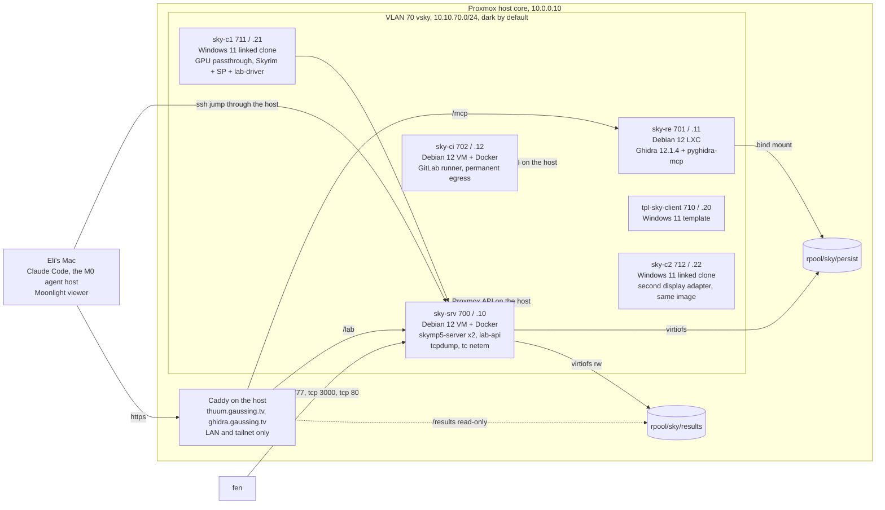

# LAB: testing infrastructure on Proxmox

The lab exists because T3 is the only tier that proves a verb, and a human
watching two Skyrim windows does not scale. Everything here is in service of
one loop: agent writes a verb, a scenario runs unattended, artifacts land in
the results dataset, the agent reads them, and a human is pulled in only for
the dynamic plan.

Two halves. The substrate (VLAN, guests, storage, DNS, access, runner) is
IaC in the estate repo, mojibake/core (Terraform bpg/proxmox plus Ansible),
driven by its operator command `sky-lab up|verify|down|reset|status` with
`snapshot` and `rollback` helpers. The lab software (lab-api, lab-driver,
scenarios, Frida scripts) lives in this repo under lab/. This document is the
contract between them, agreed on 2026-09-24 (ADR-016); a change on either
side updates this file in the same change.

## Topology


```mermaid
flowchart LR
  subgraph pve["Proxmox host core, 10.0.0.10"]
    subgraph vsky["VLAN 70 vsky, 10.10.70.0/24, dark by default"]
      srv["sky-srv 700 / .10\nDebian 12 VM + Docker\nskymp5-server x2, lab-api\ntcpdump, tc netem"]
      re["sky-re 701 / .11\nDebian 12 LXC\nGhidra 12.1.4 + pyghidra-mcp"]
      ci["sky-ci 702 / .12\nDebian 12 VM + Docker\nGitLab runner, permanent egress"]
      tpl["tpl-sky-client 710 / .20\nWindows 11 template"]
      c1["sky-c1 711 / .21\nWindows 11 linked clone\nGPU passthrough, Skyrim + SP + lab-driver"]
      c2["sky-c2 712 / .22\nWindows 11 linked clone\nsecond display adapter, same image"]
    end
    caddy["Caddy on the host\nthuum.gaussing.tv, ghidra.gaussing.tv\nLAN and tailnet only"]
    results[("rpool/sky/results")]
    persist[("rpool/sky/persist")]
  end
  mac["Eli's Mac\nClaude Code, the M0 agent host\nMoonlight viewer"]
  mac -- https --> caddy
  caddy -- /lab --> srv
  caddy -- /mcp --> re
  caddy -. /results read-only .-> results
  mac -- ssh jump through the host --> srv
  fen -- udp 7777, tcp 3000, tcp 80 --> srv
  c1 --> srv
  srv -- virtiofs rw --> results
  srv -- virtiofs --> persist
  re -- bind mount --> persist
  ci -- Proxmox API on the host --> pve
  srv -- Proxmox API on the host --> pve
```

## Guests

| name | VMID | IP | kind | power |
| --- | --- | --- | --- | --- |
| sky-srv | 700 | 10.10.70.10 | Debian 12 VM + Docker | on demand (`sky-lab up`) |
| sky-re | 701 | 10.10.70.11 | Debian 12 LXC, Ghidra 12.1.4 + JDK 21 + pyghidra-mcp | on demand |
| sky-ci | 702 | 10.10.70.12 | Debian 12 VM + Docker, dedicated GitLab runner | always on |
| sky-agent | 703 | 10.10.70.13 | reserved, not built | (M1) |
| tpl-sky-client | 710 | 10.10.70.20 | Windows 11 template | template |
| sky-c1 | 711 | 10.10.70.21 | linked clone + GPU | on demand |
| sky-c2 | 712 | 10.10.70.22 | reserved | (M2) |
| sky-build | 720 | 10.10.70.30 | reserved Windows build box | (fallback) |

VLAN 70, SDN zone `sky`, bridge `vsky`, subnet 10.10.70.0/24, gateway
10.10.70.1 (the host itself). Guest VMIDs 700 to 739 form the Proxmox
resource pool `sky`; nothing outside that range is ever in the pool.

Roles:

- sky-srv: runs the server from upstream's Docker runtime image as two compose
  services, the legacy C++ build now and the Rust-bridged build from M1, on
  different ports so difftest can drive both. Also lab-api (the scenario
  runner), the database, packet capture, and fault injection, because it sits
  on every game flow. Snapshotted before each run and rolled back after.
- sky-re: Ghidra headless with pyghidra-mcp serving the project over
  streamable HTTP. One project on rpool/sky/persist, one program per exe
  version (`just ghidra-import SkyrimSE-<version>.exe` runs analyzeHeadless
  inside sky-re with pyghidra-mcp stopped around it; SkyrimSE-1.7.104.0.exe
  was imported and auto-analyzed on 2026-09-29 in eight minutes; the pinned
  1.6.1170 goes beside it when that exe exists). CommonLibSSE-NG's names reach
  the program through `just relid` (every Address Library ID the submodule
  names, with its function, variable, vtable or RTTI name) plus the Address
  Library database for that exe version; the RTTI analyzer already names
  classes and vtables from the binary itself. CommonLib's C++ types are not
  fed to Ghidra's C parser (templates); the labels are the import.
- sky-ci: the only runner that executes this project's jobs. The estate's own
  runner holds root on the host and never runs a fork job.
- sky-c1 and sky-c2: Windows 11 linked clones of tpl-sky-client, each with
  its own display adapter, Skyrim SE plus Skyrim Platform plus lab-driver
  plus Frida. Both are lab-owned (pool `sky`), rolled back per run, and
  driven by lab-api; a two-client scenario needs both up.
- fenestrate (VM 220, VLAN 60) is Eli's desktop and only ever a file source
  (decided 2026-09-29: "not a dev machine, just a template"). It is not a
  lab client, needs no allow toward sky-srv, and nothing in the lab depends
  on it being up.
- Agent: Claude Code on Eli's Mac in M0 (ADR-016). It reaches the lab only
  through the Caddy names and the SSH jump; it has no route into VLAN 70.
  sky-agent stays reserved until unattended overnight loops need it.

## Names and access

Names used from the Mac are Caddy vhosts on the host, LAN and tailnet only,
403 to everything else:

- `LAB_API=https://thuum.gaussing.tv/lab` proxies to sky-srv:80 (lab-api).
- `https://thuum.gaussing.tv/results/<run>/` serves rpool/sky/results
  read-only, straight off the dataset.
- `GHIDRA_MCP_URL=https://ghidra.gaussing.tv/mcp` proxies to sky-re:8080
  (pyghidra-mcp, streamable HTTP). `.mcp.json` names it as a URL-type server.

Pi-hole holds `sky-srv.gaussing.tv` style A records for every guest, but
those addresses are only routable from the host, from the tailnet with
routes, or through the jump: `ssh -J root@10.0.0.10 eli@10.10.70.10`, with
`~/.ssh/config` aliases `sky-srv`, `sky-re`, `sky-ci`.

The Proxmox API is called at `https://10.0.0.10:8006` directly (Caddy 403s
guest VLANs) with an API token scoped to pool `sky` and a custom role holding
exactly VM.Audit, VM.PowerMgmt, VM.Snapshot, VM.Snapshot.Rollback,
VM.GuestAgent.Unrestricted, and VM.GuestAgent.FileRead. lab-api on sky-srv
and the jobs on sky-ci use that same token and path; `sky-lab` is the
operator's IaC command and is not called from CI.

## Egress

- Policy table 105, dark by default: blackhole default route, blackhole every
  other VLAN and the LAN, /32 allows for Pi-hole and fenestrate, a LAN return
  route only for DNAT'd Sunshine replies. Every lab guest sits here.
- Setup lease for template builds and one-time installs (Windows, Steam's
  download of Skyrim SE, SKSE, drivers, Ghidra, the JDK): `sky-lab egress
  open --minutes N`, renewable while a build runs, auto-relocks when it
  expires. Direct home IP, no VPN: nothing here needs to hide and Steam is
  happier off one.
- Policy table 106, permanent direct egress bound per host: sky-ci now
  (GitHub, crates.io, vcpkg sources), sky-agent later.
- Pi-hole additionally blocks Steam and Windows Update domains for the
  10.10.70.0/24 client group. Steam offline mode plus no route is the actual
  requirement; the DNS block is belt and braces. Version drift (Steam or
  Windows Update replacing the pinned exe) is the number one way this lab
  dies.
- Intra-VLAN traffic never touches the host, so server-to-client separation
  is not enforced by routing. Agent isolation is: the Mac has no route into
  VLAN 70 beyond the named vhosts and the jump. No second vnet.

## Host requirements

- IOMMU on, VFIO bound to the client GPU, q35, OVMF, vTPM (Windows 11 wants
  TPM 2.0), VirtIO disk and NIC, QEMU guest agent, host CPU type. Proxmox's
  PCI(e) passthrough wiki is the reference; do not improvise the vfio
  configuration.
- GPU: one per concurrent lab-owned Windows client. The RTX 5060 Ti belongs
  to fenestrate. sky-c1 has the GTX 1050 3 GB that arrived 2026-09-29 (an x1
  link; enough for Skyrim at 1080p low once assets are resident; NVIDIA
  resets reliably under vfio on this host). sky-c2 (wanted since
  2026-09-29, two lab clients) still needs an adapter: a second used card is
  the clean answer; the 9950X3D iGPU (RDNA2, two CUs) is the guarded
  experiment in the IaC, with the reset-once-per-boot reports and the host
  console against it. The 1050 cannot be shared: no vGPU on consumer Pascal
  without the vgpu_unlock hack, and 3 GB does not hold two Skyrims.
- RAM: the host has 96 GB and is tight. Phase 1 fits. Two client VMs at
  12 GB each (Skyrim SE's published minimum is 8 GB) fit only with sky-re
  powered off and sky-srv and sky-ci at their balloon floors on a T3 night;
  fenestrate being off helps and is the normal state. `sky-lab up` refuses
  to start T3 when free memory is short. A RAM upgrade is Eli's call.
- Storage: ZFS. `rpool/sky/results` (quota 500 GB, no snapshots, 30-day age
  pruning on the host) is shared into sky-srv over virtiofs at
  /srv/lab/results read-write, so a rollback of sky-srv can never delete the
  run that just finished. `rpool/sky/persist` (200 GB, snapshotted daily,
  kept) is bind-mounted into sky-re for the Ghidra project and shared into
  sky-srv for the five master .esm files, the pinned exe backup, and addrlib.
  The Windows template disk is 120 GB on the guest pool, exempt from the
  estate's hourly snapshot policy, and so are the clones' disks: ZFS rolls
  back only to the newest snapshot, so one hourly autosnap taken after
  `clean-sp` makes Proxmox refuse lab-api's rollback (seen 2026-10-01 at the
  first hour boundary after the snapshot). Licensed files never leave rpool/sky.
- Display: the client GPU needs a display target for D3D11 when nobody is
  looking, a dummy HDMI plug or a virtual display driver (the Virtual
  Display Driver project, installed into the template); Sunshine in every
  client for remote viewing, Moonlight on Eli's laptop. Sunshine's admin
  user is `lab` (password in the Mac Keychain, sky-client/sunshine), set in
  the template on 2026-09-29; the estate DNATs each client's Sunshine ports
  from the LAN and tailnet, one external base port per client since Moonlight
  derives the rest from the base it is given (live 2026-09-29, inventory
  `sky_client_streams` in mojibake/core): base 48989 is the template (710)
  now and sky-c1 (711) once the clone exists; base 49989 is sky-c2 (712).
  Each client's Sunshine is set to its own base (`just client-sunshine-port
  <vmid> <base>`; 48989 already in the template, 49989 in sky-c2 once
  cloned) and the host forwards that family one to one: TCP B-5, B, B+1,
  B+21 and UDP B+9, B+10, B+11, B+13, B+21. Translating ports does not work,
  found 2026-09-30: Moonlight takes the HTTPS port from Sunshine's own
  /serverinfo, so the pairing challenge went to 47984 on the host and was
  refused. In Moonlight add the host `10.0.0.10:48989` (LAN) or
  `core.gaussing.tv:48989` (tailnet); the pairing PIN goes into the web UI at
  https://core.gaussing.tv:48990 (LAN: https://10.0.0.10:48990), user `lab`.
  A pairing made in the template is inherited by clones. 47989 on the host
  IP is fenestrate's own Sunshine, not the lab's.
- Licensing: Steam's rule is one licensed copy per person playing at once
  (Steam Families FAQ), so two concurrent clients on one account are outside
  the supported policy. Eli's decision (2026-09-29): the lab clients use
  Eli's one account for personal use, and a second account is bought only if
  that becomes a sticking point. A Windows activation per VM. Steam in
  offline mode inside the VMs, Skyrim's update setting on "only update when
  I launch it", Windows Update paused.
- Version drift (found 2026-09-29): a current Steam install is Skyrim SE
  1.7.104.0 with master files whose CRC32s differ from the pre-AE set upstream
  tests against (libespm's Utils.cpp records both sets). Upstream's Skyrim
  Platform still loads skse64_1_6_1170.dll, so a 1.7.104 client cannot run
  SP or skymp5-client as shipped. Decided 2026-09-29 (Eli): the lab runs the
  current Steam build and the fork is made to handle it (CommonLibSSE-NG's
  active fork reads the new address library format; the port lives on the
  fork branch skyrim-1.7); the depot rollback is the fallback, not the path.
  `just persist-game` copies whatever fenestrate has into rpool/sky/persist:
  the master files as-is, and an exe that is not 1.6.1170 under its own name
  (game/SkyrimSE-1.7.104.0.exe tonight), never as the pinned SkyrimSE.exe.
- Skyrim is single-thread bound: host CPU type and no oversubscription on the
  Windows VMs during runs, or scenario timings lie.

## Client VM template (tpl-sky-client)

Build once behind a setup lease, convert to a template, clone per client.
Snapshots are disk-only: QEMU refuses snapshots with RAM for any VM with a
vfio device, so there is no "connected" snapshot to roll back to. What is
where (real since 2026-10-01):

1. The template, tpl-sky-client (710, immutable): Windows 11 activated,
   VirtIO disk and NIC, QEMU guest agent, autologon as `lab`, Sunshine on
   base 48989 paired with the laptop, the virtual display, the DirectX and
   VC++ runtimes, Steam logged in, Skyrim SE at the current build (1.7.104),
   SKSE 2.3.1, Address Library, Skyrim Platform and skymp5-client from the
   fork's dist (branch `skyrim-1.7`, fast-forwarded into `parity` on 2026-10-02), lab-driver, the lab helpers under `C:\sky-lab`
   and their scheduled tasks. No GPU in the template, so no NVIDIA driver.
2. Per clone, after `sky-lab` sets its address: `just client-bringup <vmid>
   <sunshine base> <client> <profile>` (Sunshine base port, NVIDIA driver,
   1920x1080 display, the game firewall for the dark lab, Steam in offline
   mode, crash dumps, the current client dist, the clone's client name and
   profile id, launch test),
   then the clone's `clean-sp` snapshot, taken cold (game stopped, VM shut
   down). That snapshot is what lab-api rolls back to
   (lab/deploy/sky-client/README.md, "Clone bring-up"). From M1 (2026-10-02)
   the target is `clean-m1`, the wire client taken cold on top of
   `clean-sp`, which stays as the RakNet baseline: Proxmox rolls back only to
   the newest snapshot, so deleting `clean-m1` (and pointing
   lab/labapi/labapi/guests.yaml back at `clean-sp`) is the way back. Steam offline mode is
   what lets a cold boot in the dark lab reach a running game at all.
   sky-c1 (711, GTX 1050) and sky-c2 (712, RTX 5060 Ti) are both through it
   as of 2026-10-01. On sky-c2 the driver installer first refused the card
   (exit -436207360, no log, the device at Code 43 as any NVIDIA card is
   before its driver): the package was the Pascal branch, fetched for the
   GTX 1050's product id, which carries no Blackwell entries; the lab keeps
   one package per card family now (lab/deploy/sky-client/README.md). Two
   host variables were measured as non-causes on the way: the hidden
   hypervisor flag (`cpu: host,hidden=1`, fenestrate's setting, now on both
   clones and harmless) and Secure Boot (the installed driver drives the
   card with the template's keyed EFI store, so the clones stayed identical
   to the template). The estate's PCI mapping names are
   swapped against the hardware: `gpu-gtx1050` is 0000:01:00.0, the 5060
   Ti, and `gpu-sky` is 0000:0b:00.0, the GTX 1050; renaming touches
   fenestrate's config and waits for Eli.
   The current build's Data carries ten plugins (the five masters,
   _ResourcePack.esl and the four free Creation Club plugins) while the
   server loads the five masters, so skymp5-client shows "LOAD ORDER
   WARNING: you have more mods than server" for five seconds at login; the
   check passes because the first five match in order. The client's order
   is the engine's: the five masters, then the plugins present on disk in
   the order of the game's own Skyrim.ccc (ccBGSSSE001-Fish.esm,
   ccQDRSSE001-SurvivalMode.esl, ccBGSSSE037-Curios.esl,
   ccBGSSSE025-AdvDSGS.esm), then _ResourcePack.esl. The five extra files
   (2.6 MB in all, identical on every Steam install) sit in
   rpool/sky/persist/esm beside the masters since 2026-10-01, pulled off
   sky-c1 through the guest agent. They are not in the server's loadOrder
   yet: libespm has no light-plugin (.esl) handling, so the server would
   give those records full load indices where the client compacts them into
   the FE space, and form ids would disagree. Load-order parity therefore
   waits on ESL support in libespm, a port item.
   Also open: Skyrim Platform logs "on('update'): failed to get key 'data':
   failed to call custom Serialize for type struct Equipment: ... class
   Inventory" once per login on the 1.7.104 client (c1.log of run
   20261001-195142, with the patch-08 build); the game continues and
   movement syncs, so it is parked until m0-inventory shows whether
   equipment and inventory updates reach the server.
   Also open: lab-spawn (upstream's default start point) is a mountain top.
   The flat strip runs along x = 0 from the origin to about y = -450
   (probed 2026-10-01: (0, -150) to (0, -450) settle at z 11 to 15; (0, +150)
   and (200, 0) are over the north and east edges, (150, -300) and
   (-200, 0) are slopes). 300 units east the player fell about 1070 units.
   Teleports after a fall land fine; what looked like "ignored after a
   fall" was the post-login window (the teleport step above). Two actors
   placed on one spot are shoved apart by the engine, on this summit
   north-east and down the slope, so the clean world parks the profiles
   apart and off every scenario target: profile 1 at (0, -296), profile 2
   at (0, -450); the origin and the first 300 units south of it are c1's
   (runs 20261001-223515 and 225648 fell that way with profile 2 parked at
   the origin). Scenario offsets stay on that strip until lab.esp provides
   a level cell (Track L4).

"Connected" is not a snapshot; it is where a clone arrives by itself: stop,
rollback to `clean-sp`, cold boot, autologon, the scheduled task launches
SKSE and lab-driver, lab-driver heartbeats to lab-api. Budget 90 to 120 s per
client rollback; scenario timeouts are sized for it.

The lab's own files on a client live under `C:\sky-lab` and nowhere else:
`just stage-client <vmid>` puts the built lab-driver, its settings, the
skymp5-client settings for sky-srv, and the PowerShell helpers there through
the guest agent (lab/deploy/sky-client/README.md); `install-lab.ps1` applies
them once the game, SKSE and SP exist and registers the logon launch task and
an on-demand screenshot task for the lab user. Staged into tpl-sky-client on
2026-09-29; the `clean-sp` snapshot carries it.

lab-driver is a small SP plugin: on the `update` tick it polls
`GET /lab/step?client=<id>` (SP ships an HTTP client), executes the step it
gets back (teleport via server command, equip, cast, activate, hit, wait,
request-screenshot, dump-state), and posts the result to
`POST /lab/step/<id>/result` with the client's view of the relevant refs. It
is the only automation surface inside the game; keep its verbs boring. On
sky-c1 and sky-c2 it reaches lab-api at http://10.10.70.10/lab inside the
VLAN.

Screenshots and Frida invocations go through a guest exec from lab-api,
not through the game, so a crashed client can still be observed. Scripts
reach the client by the client pulling them from lab-api over http inside
that guest exec; artifacts come back through the Proxmox guest-agent file
API, which caps each file at 16 MiB, so Frida traces are rotated into files
under that size. The token has no FileWrite privilege.

## Scenario runner (lab-api on sky-srv)

Python, listening on sky-srv:80 under the root path /lab (a setting), behind
Caddy at https://thuum.gaussing.tv/lab. It honors X-Forwarded-For for logs
and has no auth of its own; the vhost is LAN and tailnet only. Endpoints,
pinned:

| method and path | purpose |
| --- | --- |
| POST /lab/up | bring the lab up: sky-srv snapshot check, clients cloned or rolled back, heartbeats waited on |
| POST /lab/down | roll back clients and server, clear netem |
| GET /lab/status | guest power, heartbeats, netem state, free memory |
| POST /lab/run | multipart scenario YAML in; returns a run id immediately |
| GET /lab/run/<id> | progress, then result.json when the run is done |
| GET /lab/step?client=<id> | lab-driver's poll for the next step |
| POST /lab/step/<id>/result | lab-driver's report for a step |
| POST /lab/frida | client and script in; starts a trace through a guest exec |
| GET /lab/state/<query> | proxy to the lab gamemode's state endpoint on the server |

Results are browsed at https://thuum.gaussing.tv/results/<run>/.

Scenario verbs. connect and reconnect are judged by the server (lab-api
holds the step until labState lists the client online; the driver never
touches mpClientPlugin). teleport is judged by the client it is imposed on
and then by the server: 3 s after each send the client reports its own
position (dump-state) and the record is read back, both must sit at the
target, else the teleport is sent again, because the client drops position
moves until about eight seconds after online (Skyrim Platform blocks
MoveRefrToPosition while its generated save settles; measured on sky-c1,
2026-10-01) and the written record alone can stand for seconds. Every
client step records the server's position of that client afterwards in
result.json (`pos`), and a driver step's answer rides in its `note`. The other client verbs run in lab-driver: move,
equip, cast, activate, hit, dump-state, request-screenshot, craft (an open
driver item that m0-forge specifies), tap-key (one DirectInput scan code
through SKSE's Input.TapKey, for menus the server cannot close for the
client, such as the race menu's Done), and watch-start / watch-stop (the
client follows every actor near it at watch-start, by form id, each frame
until watch-stop, and reports how far each got from where it began; for
"the observer never saw X" checks that one dump-state would sample too
late). Server verbs are written as client
steps too (`c1: give {...}`) but go to the gamemode's labCommand RPC as
rung R0: teleport, give, set-appearance, set-percentages, kill, respawn.
`screenshot` is a guest exec on a managed client (request-screenshot is
the in-game fallback). Assertions read `server.actor(c)`, `server.inventory(c)`,
`c.state` (the client's own dump), `c.sees(other)` and `c.view(other)` (the
dump's nearby actors matched to the server's position for `other`),
`c.watched(other)` (the last watch-stop's actor that started where the
server has `other`: `x, y, z`, `maxDisplacement`, `samples`), and
`form("File.esm:EditorID")` through lab-api's item table. Coordinates in a
scenario are offsets from a named cell's origin (`cells` in lab-api's
guests.yaml; `lab-spawn` is the server's default start point until lab.esp
provides a cell); lab-api converts to and from the engine's absolute
coordinates on both the server and the client side.

Input is a YAML scenario (see lab/scenarios/). The runner:

1. Rolls the server back to the scenario's snapshot. lab-api runs on sky-srv
   itself, so per scenario it restores server state, not the VM: stop the
   server container, restore `world/` from the named snapshot directory,
   `docker compose up`, wait for tcp/3000. `clean` (/srv/lab/snapshots/clean)
   is the lab's baseline world: the lab clients' recorded characters and
   nothing else (profiles 1 and 2 since 2026-10-01; profile 1's look was
   recorded from the race menu into lab/gamemode/presets/lab-nord-1.json,
   profile 2 got the same preset through set-appearance, which also clears
   the server's race-menu flag), because a profile without an
   appearance lands in the race menu, which pauses the world, and the stock
   client cannot close that menu on the server's say-so. Its records park
   profile 1 at lab-spawn (0, -296) and profile 2 at (0, -450), apart and
   off every scenario target (see the summit note under M0 status); a
   profile's parking spot is edited in changeForms/<n>.json of the
   snapshot (absolute coordinates), not re-recorded. The empty world is
   kept beside it as `clean-empty-<stamp>`, and each earlier baseline as
   `clean-<what>-<stamp>`. The VM-level rollback (stop,
   rollback to the named disk snapshot, start; budget 20 to 40 s) is the
   operator's `sky-lab` action between scenario sets, and lab-api can drive
   it only when hosted elsewhere (`SERVER_ROLLBACK_MODE=vm`). sky-srv carries
   virtio-fs shares, which are incompatible with RAM snapshots, so every
   rollback in the lab is disk-only; sky-re is rolled back with `pct`.
2. Applies netem if asked.
3. Rolls each named client back and starts it; waits for the lab-driver
   heartbeat.
4. Feeds steps in order; each step names a client or the server; waits for
   the ack or the timeout.
5. Runs assertions: server-side through the lab gamemode's state endpoint
   and the database directory; client-side against what lab-driver reported;
   wire-side against the pcap when a step asks for it.
6. Collects artifacts and writes result.json. Exit code is the verdict.

Artifacts per run, under /srv/lab/results/<timestamp>-<scenario>/:
server.log, c1.log, c2.log, screenshots/, world-before/ and world-after/
(copies of the server's `world/` directory, the `file` database driver;
there is no sqlite), world-diff, lab.pcap, frida/*.jsonl, result.json.
During M0 and M1 the pcap is also the source for difftest sessions:
`pcap2session` runs on it and the resulting YAML lands in
skymp/skymp-wire/difftest/sessions/ (docs/WIRE.md).

Server settings in the lab: `offlineMode` true (any profile id may connect),
`databaseDriver` `file`, port 7777 (udp) with the embedded UI on 3000 (https,
non-configurable, main port + 1 when the main port moves), the master-list
announce to skymp.io disabled, the five master .esm files from
rpool/sky/persist in the data directory, plus the lab gamemode script.

Assertions live in the YAML, and the runner is the only thing that can mark
a scenario green (ADR-009). Scenario YAML is review-gated (ADR-016): a
change travels in its own commit, Eli approves it, and CI refuses a commit
that mixes scenario YAML with other files.

## Network faults

Inside sky-srv, per scenario:

```
tc qdisc add dev eth0 root netem delay 60ms 15ms loss 0.5%
```

Cleared on teardown. Every M2+ scenario runs at least once with faults on,
because lag compensation and host handoff are the things that only break
under them. tcpdump on sky-srv's own interface gives the pcap; it sees only
sky-srv's flows, which is all the game traffic, and T2 fake clients use the
same capture path so wire assertions are shared between tiers.

## Dynamic RE lane

Two speeds:

- Agent-drivable: Frida. Scripts hook functions by Address Library ID
  (resolved to an address at attach time from the loaded module base), log
  arguments and return values as jsonl, and are started and stopped by
  scenario steps through a guest exec. The agent writes the script from the
  verb doc's Dynamic section, runs the scenario, and reads the trace from
  the results dataset. This is what turns "learn its side effects" into
  something that can happen overnight. Skyrim has no anti-cheat; SKSE and
  Frida coexist.
- Human: an x64dbg session on a `sky-dbg` snapshot of sky-c1 (x64dbg
  installed, addresses pre-resolved from addrlib into a labels file). The verb
  doc's breakpoint plan is the script for the session; Moonlight to watch;
  findings go back into the verb doc as CONFIRMED with the run id.

Static RE is pyghidra-mcp on sky-re, reached at GHIDRA_MCP_URL; the
re-analyst subagent's procedure is unchanged, only the transport.

## CI

- GitLab CI on sky-ci (ADR-016). T0 and the wire tests on every push; bounded
  fuzz per push, longer fuzz nightly.
- T2 nightly and on every merge request that touches the wire contract.
- T3 nightly for the current milestone's scenario set once phase 3 exists; on
  demand with a `lab` label. A scenario that fails twice reopens its verb.
- Upstream's own GitHub workflows keep running on the public mirror; they
  build the server, the client, and Skyrim Platform on GitHub-hosted runners
  and prove that the weekly rebase did not break upstream's build.
- The runner reaches the Proxmox API with the pool-scoped token described
  above; the IaC itself stays with `sky-lab` and the core repo.

## Bill of constraints

- GPUs equal concurrent lab-owned clients; there is no attended extra.
- Licenses equal concurrent clients.
- Windows activation per VM.
- A T3 run is minutes plus 90 to 120 s per client rollback; a human dynamic
  session is an hour. Size verbs so one run answers one question.
- Client VMs are never reachable from the agent; lab-api is the boundary,
  and results are read-only to the agent.
- RAM: phase 3 nights run at floors until the host is upgraded.

## Build order

1. sky-srv, sky-ci, and the T2 fakeclient harness. No GPU, no Windows;
   unblocks M1 entirely. sky-srv runs the legacy server now and adds the
   bridged server when the bridge PR lands, so difftest can drive both.
   Live since 2026-09-29: `just test-proto` is the T2 gate on sky-srv, and
   a scenario with `clients: []` plus `server: fakeclient {as: c1, ...}`
   steps (t2-fakeclient-restart) runs through lab-api with no Windows
   client at all; the server image is the T2 runtime (fakeclient and
   difftest both execute inside it).
2. sky-re with pyghidra-mcp.
3. sky-c1 with the 1050, sky-c2 with the second adapter;
   `smoke-two-players` green, unattended once both clones boot to connected.
   Done 2026-10-01: run 20261001-233455 (17 of 17 steps, 3 min 10 s wall,
   both clones rolled back and booted to connected in 81 s).

## References

- Proxmox PCI(e) passthrough: https://pve.proxmox.com/wiki/PCI(e)_Passthrough
- i915 SR-IOV DKMS (Intel iGPU option, not used here): https://github.com/strongtz/i915-sriov-dkms
- pyghidra-mcp: https://github.com/clearbluejar/pyghidra-mcp
- GhidraMCP (GUI plugin; superseded here by pyghidra-mcp): https://github.com/LaurieWired/GhidraMCP
- Ghidra releases: https://github.com/NationalSecurityAgency/ghidra/releases
- Frida: https://frida.re
- Sunshine: https://github.com/LizardByte/Sunshine
- Moonlight: https://moonlight-stream.org
- x64dbg: https://x64dbg.com
- CommonLibSSE-NG host-less testing note: https://github.com/CharmedBaryon/CommonLibSSE-NG
- Skyrim Platform HTTP and events: https://github.com/skyrim-multiplayer/skymp/blob/main/docs/docs_skyrim_platform.md
- skymp server ports: https://github.com/skyrim-multiplayer/skymp/blob/main/docs/docs_server_ports_usage.md
- skymp database drivers: https://github.com/skyrim-multiplayer/skymp/blob/main/docs/docs_database_drivers.md
- skymp server configuration: https://github.com/skyrim-multiplayer/skymp/blob/main/docs/docs_server_configuration_reference.md
- Proxmox API, guest agent file-read (16 MiB cap): https://pve.proxmox.com/pve-docs/api-viewer/#/nodes/{node}/qemu/{vmid}/agent/file-read
